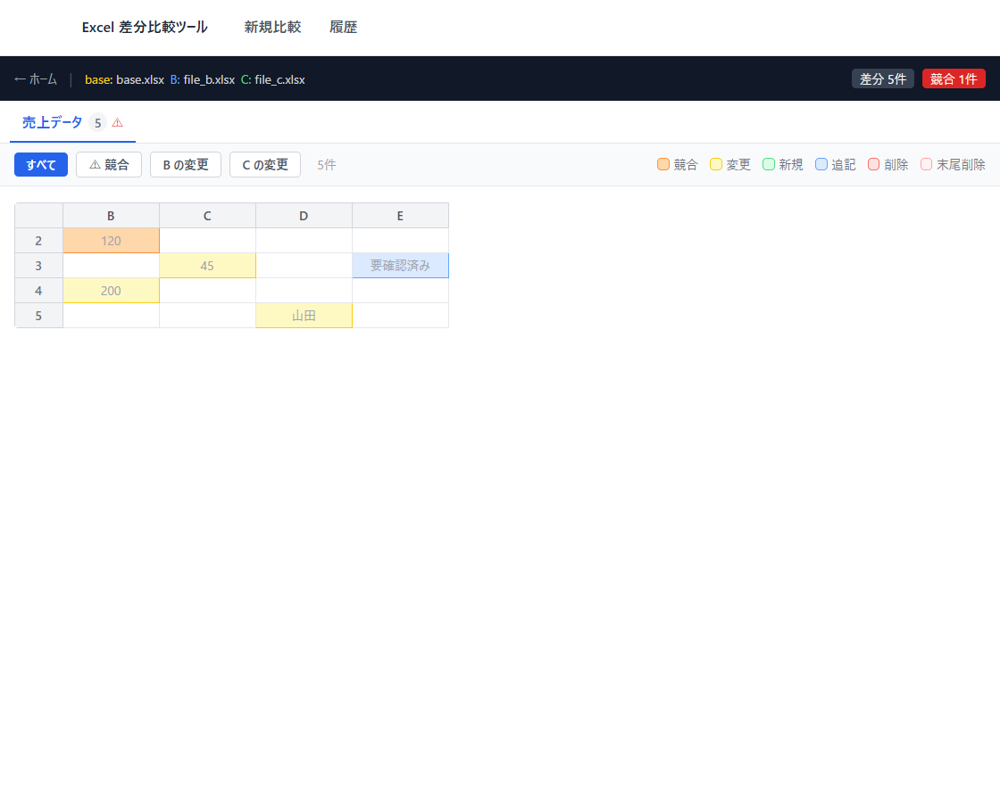

# Excel 差分比較ツール

Excel ファイル（2〜3ファイル）のセル差分をブラウザで確認するためのデスクトップツール。

> **現在の到達点**
> このプロジェクトの目的は、同じ Excel を複数人で並行編集したときの**3ファイルのマージを支援すること**です（[docs/purpose.md](docs/purpose.md)）。
> 現在は、その前段階となる**差分の比較・閲覧**までを実装しています。マージ機能は今後実装する予定です。



## 特徴

- `.xlsx` / `.xlsm` を 2〜3ファイル同時に比較
- 変更種別（新規・追記・削除・更新・競合）を色分け表示
- セルをクリックして Base / B / C の値を詳細比較
- 矢印キーでモーダルを開いたまま変更セル間を移動
- 比較履歴の保存と再閲覧

## 使い方

→ [docs/manual/getting_started.md](docs/manual/getting_started.md)

## 開発の進め方

Claude Code と協働し、**仕様をドキュメントとして先に確定させてから実装する**進め方をとっています。

```
要件（REQ） → 振舞（Given/When/Then） → タスク（TASK） → 実装・テスト
```

- **要件と振舞**：`docs/requirements/` に、要件（`spec.md`）とその振舞（`behaviors/B-XXX.md`）を置いています。各ファイルに `draft` / `approved` のステータスがあり、上位が `approved` になるまで下位には進みません。
- **タスク**：`tasks/active/TASK-XXX.md` が作業の単位です。変更してよいファイルを `files:` に列挙し、1回の指示で1タスクだけを行います。完了したタスクは `tasks/done/` に移します。
- **CLAUDE.md**：上記のルールを [CLAUDE.md](CLAUDE.md) に書き、AI の作業範囲がタスクの外に広がらないようにしています。
- **テスト**：振舞の Given/When/Then をそのままテストケースにしています。まだ実装していない振舞（コメント・図形・カスタムルール）のテストは先に書き、`xfail` を付けています。

詳しい手順は [docs/workflow.md](docs/workflow.md)、全体構成は [docs/architecture.md](docs/architecture.md) を参照してください。

## テストの実行

```powershell
# バックエンド（pytest）
cd backend
poetry install --extras dev
poetry run pytest

# フロントエンド（Vitest）
cd frontend
npm ci
npm test
```

## 変更履歴

→ [CHANGELOG.md](CHANGELOG.md)

## 技術スタック

| 層 | 技術 |
|----|------|
| フロントエンド | React + TypeScript + Vite + Tailwind CSS |
| バックエンド | Python + FastAPI |
| Excel 解析 | zipfile + xml.etree.ElementTree（openpyxl 不使用） |
| テスト | pytest + httpx / Vitest + Testing Library |
| 配布 | PyInstaller（単一 exe） |
