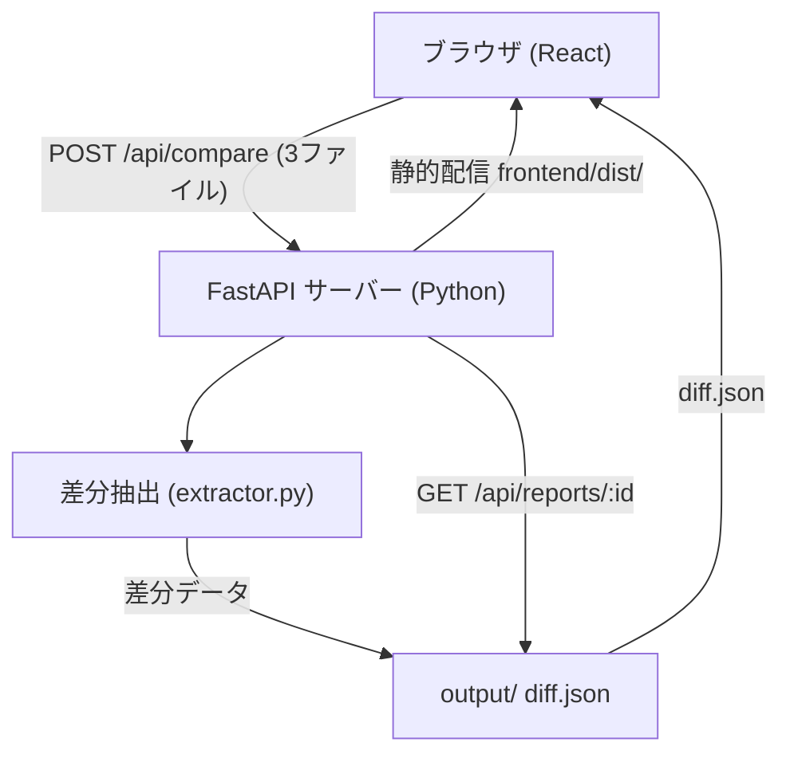
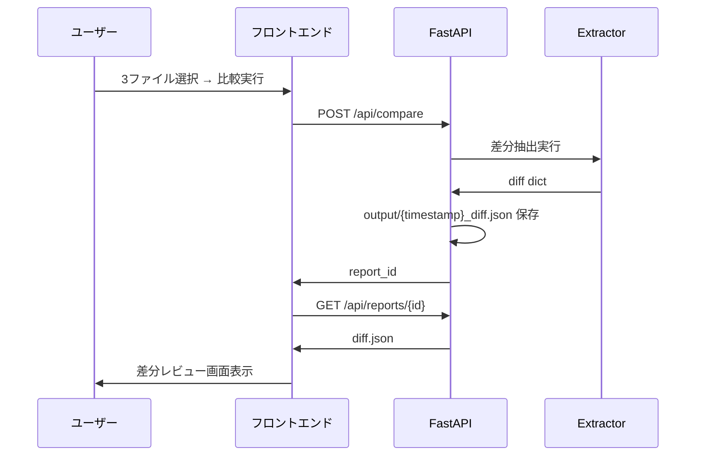

# アーキテクチャ



## コンポーネント概要

| コンポーネント | 技術 | 役割 |
|-------------|------|------|
| フロントエンド | React 18 / Vite / TypeScript / Tailwind | アップロード・差分レビューUI |
| APIサーバー | FastAPI / uvicorn | ファイル受付・結果配信 |
| 差分抽出 | Python（標準ライブラリのみ） | ZIP解凍・XML比較・diff.json生成 |

## データフロー



## フォルダ構成

```
backend/
├── src/
│   ├── main.py          # FastAPI アプリ定義・エントリポイント
│   └── extractor.py     # 差分抽出コアロジック
├── pyproject.toml
├── poetry.lock
└── .venv/               # 仮想環境（git管理外）

frontend/
├── src/                 # Reactソース
├── dist/                # Viteビルド成果物（FastAPIが静的配信）
└── package.json

output/                  # 生成されたレポートJSON
```

## 起動方法

```bash
# バックエンド
cd backend
poetry install
poetry run python src/main.py
# → http://localhost:8080

# フロントエンド（初回・変更時）
cd frontend
npm install
npm run build
```
