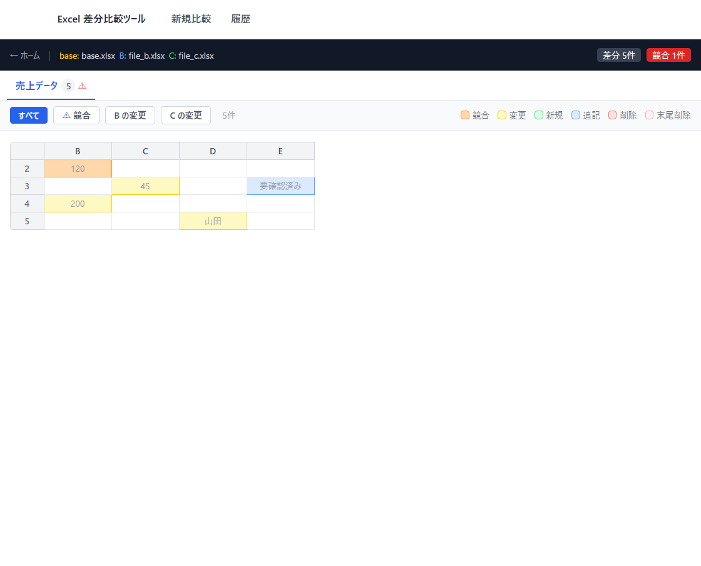
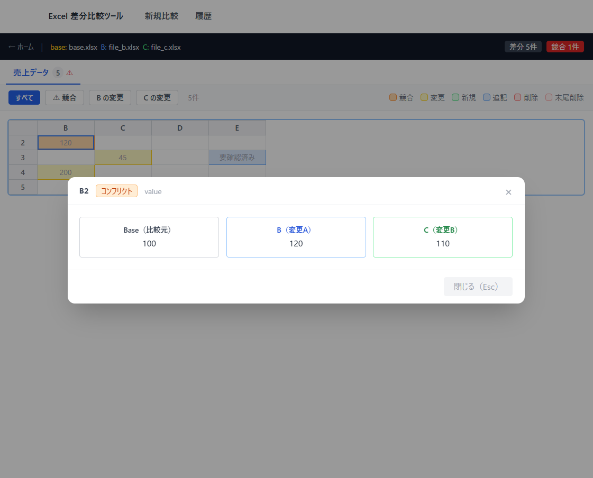

# 操作方法

## 比較の実行

### 1. ホーム画面でファイルを追加する

- ドロップゾーンに .xlsx / .xlsm ファイルをドラッグ＆ドロップ
- または「ファイルを選択」クリックでダイアログから選択
- 2〜3ファイルを追加する

### 2. 比較元（Base）を選択して実行する

- ラジオボタンまたは行クリックで比較元（Base）を指定
- 先頭ファイルがデフォルトで選択される
- **「比較実行」** ボタンをクリック

---

## 結果の確認

### 差分グリッド

- 変更セルが色分けで一覧表示される
- **フィルター**：「すべて」「競合」「Bの変更」「Cの変更」で絞り込み
- **シートタブ**：複数シートがある場合はタブで切り替え

### セル詳細モーダル

- セルをクリックすると Base / B / C の値を詳細比較できる
- **矢印キー（← →）**：モーダルを開いたまま隣接する変更セルへ移動

### 色の意味

| 色 | 意味 |
|----|------|
| オレンジ | 競合（B と C が異なる値に変更） |
| 緑 | 新規追加（null → 値） |
| 青 | 末尾に追記（add） |
| 赤 | 削除（値 → null） |
| 薄赤 | 末尾から削除（sub） |
| 黄 | 更新（その他の変更） |

---

## 履歴

- 過去の比較結果を一覧で確認できる
- 右上のドロップダウンで1ページあたりの表示件数を切り替え（10 / 25 / 50件）
- 行をクリックするとレポートを再表示
