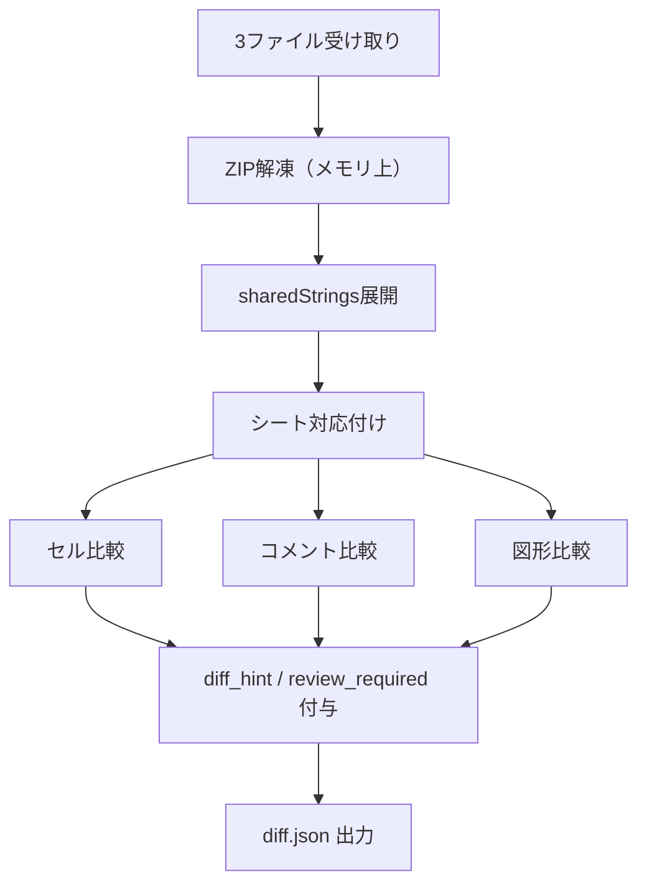

# REQ-001 設計

## 処理フロー



### 詳細

```
1. ZIP解凍（メモリ上）
   └── xl/sharedStrings.xml
   └── xl/worksheets/sheet*.xml
   └── xl/drawings/drawing*.xml
   └── xl/drawings/vmlDrawing*.xml

2. sharedStrings の展開
   └── インデックス → 文字列のリストを生成
   └── インライン文字列（<is>タグ）も処理

3. シートの対応付け
   └── xl/workbook.xml からシート名とリレーションIDを取得
   └── base に存在するシートを基準としてマッピング

4. セル比較（各シート）
   └── base vs B、base vs C でそれぞれ比較
   └── diff_hint・review_required を付与（B-003）

5. コメント比較
   └── xl/comments*.xml をパース（ノート・旧形式）
   └── xl/threadedComments/*.xml をパース（スレッドコメント・新形式）
       └── スレッド内の全返信テキストを結合して1テキストとして扱う

6. 図形比較
   └── drawing*.xml（標準）と vmlDrawing*.xml（旧形式）をパース
   └── 図形IDで対応付け
```

## テキストdiff判定

```python
import difflib

def get_diff_hint(base: str, new: str) -> str:
    if not base:
        return "new"
    ops = {op for op, *_ in difflib.SequenceMatcher(None, base, new).get_opcodes()}
    ops.discard("equal")
    if ops == {"insert"}:
        return "insert_only"
    if ops == {"delete"}:
        return "delete_only"
    return "replace"
```

## 日付判定

ExcelのXML内で日付はシリアル値（数値）として保存されているため、数値比較で判定する。

```python
def is_newer_date(base_serial: float, new_serial: float) -> bool:
    return new_serial > base_serial
```

## 変更状態の判定

| 状態 | b_value | c_value | conflict | review_required |
|------|---------|---------|----------|----------------|
| Bのみ更新 | 値あり | null | false | B-003ルール依存 |
| Cのみ更新 | null | 値あり | false | B-003ルール依存 |
| B=C（同値変更） | 値あり | 値あり | false | false（B優先で自動採用） |
| コンフリクト（B≠C） | 値あり | 値あり | true | true |

## 決定事項

| 項目 | 決定内容 | 理由 |
|------|----------|------|
| B=C（同値変更）の扱い | conflict: false、review_required: false、B優先で自動採用 | B=Cなので実質同じ値。人間の判断不要 |
| 数式の比較方針 | 数式文字列 `<f>` で比較。計算済み値 `<v>` は比較しない | 計算結果の変動は対象外（制限事項#1） |
| 図形の対応付け | 図形IDで対応付け。IDが一致しない図形は「未対応付け図形」として出力 | 図形名はデフォルトで重複しやすいためIDが信頼性高い |
| リッチテキスト変更の検出 | sharedStringsの `<si>` XML全体を比較し、書式だけの変化も検出する | 部分書式の変化を見逃さないため |
| 自動マージ判定 | `review_required` と `diff_hint` を差分に付与する | UIで人間が確認すべき行を絞り込めるようにするため |
| 日付の自動マージ | 日付が新しくなる変更（かつ競合なし）は `review_required: false` とする。オプション設定でOFF可能 | 日付の更新は多くの場合意図した変更のため |
| カスタムルール設定 | `config/merge_rules.yaml` にシート・列・セル単位でルールを定義できる | 業務ルールに応じた柔軟な判定を可能にするため |
| 除外文字列 | グローバルとルール単位の両方で定義可能。適用値は和集合 | テンプレート文字列への新規入力を「変更」として扱うため |
